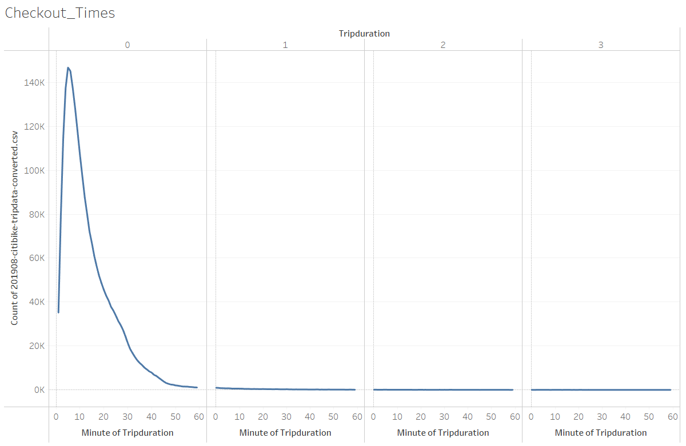
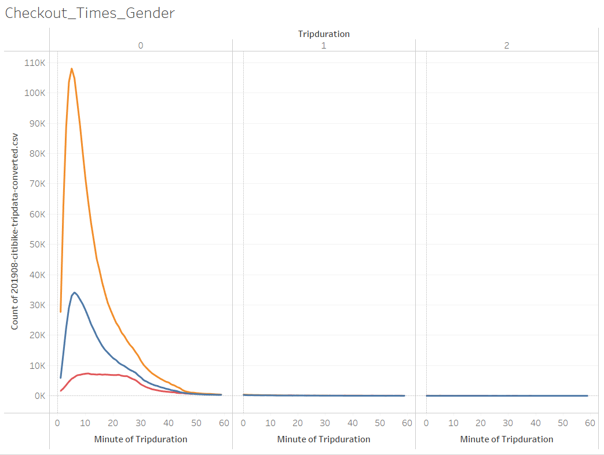
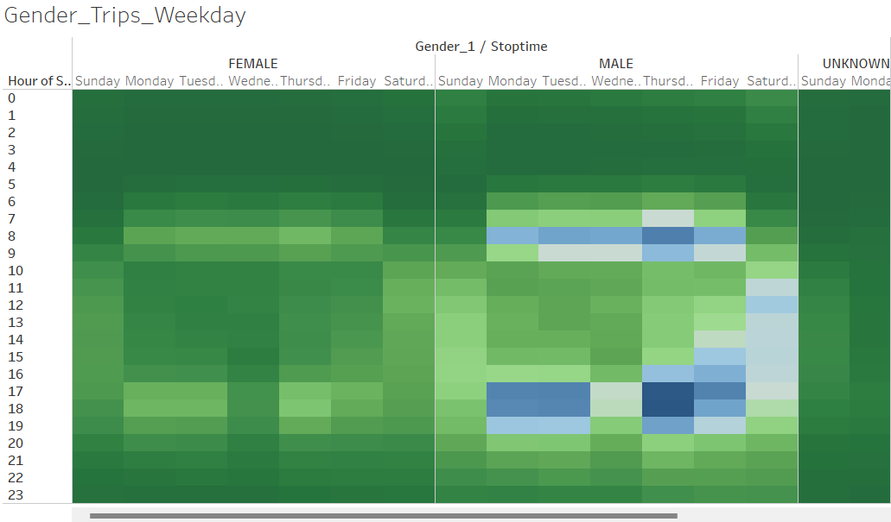
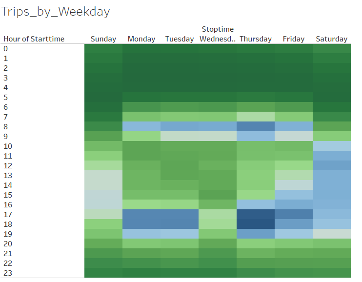
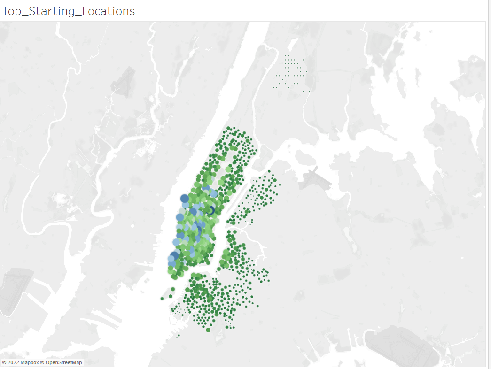
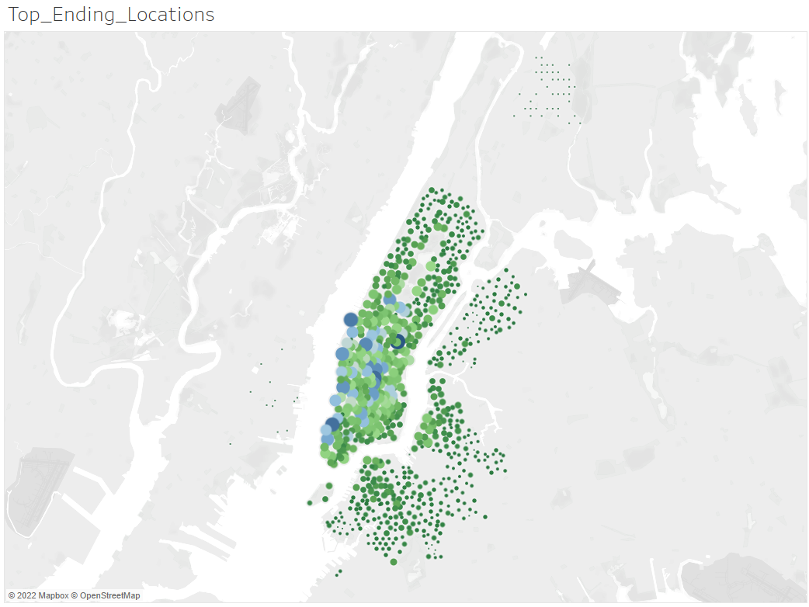
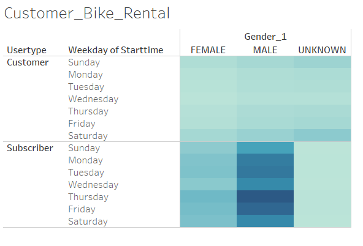

# Summary
Our purpose for this challenge was to use data from New York City bikesharing community and analyze certain trends. We used pandas inconjuction with Tableau to put together our analysis. 

## Data
* Data that was used came from the New York City bike sharing database in August 2019

## Results
* Results were put into a story board that can be viewed using the link below. Additionally, I have included all of the visuals that make up the story board in this readme. 

# Link for Tableau Public
https://public.tableau.com/app/profile/trevor.hamilton/viz/NYCCitiBook/NYCCityBikeReport?publish=yes